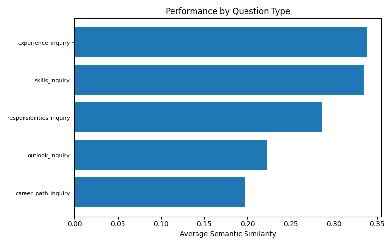

# Du Won Career Pathfinder 🚀

An AI-powered career guidance platform that combines machine learning, natural language processing, and modern web technologies to provide personalized career recommendations and insights.

## 🌟 Features

### 🤖 AI-Powered Chatbot
- **Streaming Responses**: Real-time conversational AI with custom fine-tuned Mistral model
- **Voice Input**: Integrated Whisper speech-to-text with reusable voice components
- **Career-Focused**: Intelligent content filtering to ensure career-relevant conversations
- **Context-Aware**: Maintains conversation history and integrates quiz data for personalized responses
- **Multi-Model Support**: Switch between Gemini and custom Qnizer (Mistral) models
- **Mobile Responsive**: Optimized chat interface for all device sizes

### 📊 Career Assessment Tools
- **Interactive Career Quiz**: Comprehensive questionnaire analyzing skills, interests, and experience
- **CV Analysis**: Upload PDF resumes for AI-powered career recommendations with spaCy keyword extraction
- **Skill Gap Analysis**: Identify areas for professional development
- **Career Path Visualization**: Explore different career trajectories
- **ML-Powered Predictions**: Machine learning models for career recommendation

### 🔍 Intelligent Job Search
- **Semantic Search**: Natural language job queries powered by vector embeddings
- **RAG-Enhanced Results**: Contextual job recommendations using retrieval-augmented generation
- **Real-time Filtering**: Dynamic search with intelligent matching

### 🗄️ Dynamic Knowledge Base Builder
- **Wikipedia Integration**: Automatically generate knowledge bases from Wikipedia content
- **Custom Topics**: Create specialized databases for different career domains
- **RAG Testing Environment**: Test and validate knowledge base performance with integrated chat
- **Parallel Processing**: Optimized generation with concurrent topic processing
- **Voice-Enabled Testing**: Voice input support in knowledge base testing interface

### 🎙️ Voice Input System
- **Whisper Integration**: OpenAI Whisper model for accurate speech-to-text conversion
- **Reusable Components**: VoiceInputButton component and useVoiceInput hook for consistent UX
- **Career Content Filtering**: Voice inputs restricted to career-guidance topics
- **Multi-Language Support**: Automatic language detection and processing
- **Real-time Feedback**: Visual recording indicators with animated UI elements

### 🎨 Modern User Experience
- **Glassmorphism Design**: Beautiful, modern UI with backdrop blur effects
- **Responsive Layout**: Seamless experience across desktop, tablet, and mobile
- **Smooth Animations**: Framer Motion powered transitions and interactions
- **Dark Theme**: Elegant dark mode interface
- **Accessibility**: Proper ARIA labels and keyboard navigation support

## 🛠️ Technology Stack

### Backend Architecture
- **Framework**: FastAPI with async/await support
- **AI/ML Stack**: 
  - LangChain for LLM orchestration
  - Ollama for local model serving
  - Custom fine-tuned Mistral model (ft:ministral-3b-latest:9b8fa9c6:20250902:e97f6b36)
  - OpenAI Whisper for speech-to-text
  - ChromaDB for vector storage
  - spaCy for NLP processing and keyword extraction
- **Data Processing**: 
  - PyPDF for document parsing
  - EasyOCR for text extraction
  - Pandas for data manipulation
- **APIs**: Wikipedia integration, streaming endpoints, speech-to-text endpoints

### Frontend Architecture
- **Framework**: React 18 with TypeScript
- **Build System**: Vite for fast development and building
- **Styling**: 
  - Tailwind CSS for utility-first styling
  - Shadcn/UI for accessible components
  - Framer Motion for animations
- **State Management**: 
  - React Context for global state (QuizContext, NavbarContext, ModelContext)
  - TanStack React Query for server state
- **Voice Integration**:
  - MediaRecorder API for audio recording
  - Custom useVoiceInput hook for reusable voice functionality
  - VoiceInputButton component for consistent UI
- **Routing**: React Router v6 with nested routes
- **Forms**: React Hook Form with Zod validation

## 🚀 Getting Started

### Prerequisites

- **Python 3.9+** with pip
- **Node.js 18+** with npm
- **Ollama** (for local LLM serving)
- **Git** for version control

### 🔧 Installation

#### 1. Clone the Repository
```bash
git clone <repository-url>
cd Du-Won-Career-Pathfinder
```

#### 2. Backend Setup
```bash
cd backend

# Create virtual environment
python -m venv venv

# Activate virtual environment
# Windows:
.\venv\Scripts\activate
# macOS/Linux:
source venv/bin/activate

# Install dependencies
pip install -r requirements.txt

# Set up environment variables
cp .env.example .env
# Edit .env with your API keys (MISTRAL_API_KEY)

# Start the backend server
uvicorn main:app --reload --host 0.0.0.0 --port 8000
```

#### 3. Frontend Setup
```bash
cd frontend

# Install dependencies
npm install

# Start development server
npm run dev
```

#### 4. Access the Application
- **Frontend**: http://localhost:5173
- **Backend API**: https://qxl9vbnw-8000.asse.devtunnels.ms
- **API Documentation**: http://localhost:8000/docs

## 📁 Project Architecture

```
Du-Won-Career-Pathfinder/
├── 📂 backend/                    # FastAPI Backend
│   ├── 📄 main.py                # Main API application
│   ├── 📄 llm_services.py        # LLM and RAG services
│   ├── 📂 classification/        # Career prediction models
│   ├── 📂 langchain_kb/          # Knowledge base management
│   │   └── 📂 expand/            # Wikipedia KB generator
│   ├── 📂 data/                  # Training datasets
│   ├── 📂 all_min_chromadb/      # Vector database storage
│   └── 📄 requirements.txt       # Python dependencies
│
├── 📂 frontend/                   # React Frontend
│   ├── 📂 src/
│   │   ├── 📄 App.tsx            # Main application component
│   │   ├── 📂 components/        # Reusable UI components
│   │   │   ├── 📄 Navbar.tsx     # Navigation with mobile support
│   │   │   ├── 📄 CareerQuiz.tsx # Interactive career assessment
│   │   │   ├── 📄 DeveloperInsights.tsx # Knowledge base builder
│   │   │   └── 📄 KnowledgeEngineeringSystem.tsx # Main dashboard
│   │   ├── 📂 pages/             # Application pages
│   │   │   ├── 📄 Contact.tsx    # AI Chatbot interface
│   │   │   └── 📄 About.tsx      # About page
│   │   ├── 📂 contexts/          # React contexts for state
│   │   │   ├── 📄 QuizContext.tsx # Quiz data management
│   │   │   ├── 📄 ModelContext.tsx # AI model selection
│   │   │   └── 📄 NavbarContext.tsx # Navigation state
│   │   └── 📂 hooks/             # Custom React hooks
│   └── 📄 package.json           # Node.js dependencies
│
├── 📂 dataset/                    # Data processing and datasets
└── 📄 README.md                  # Project documentation
```

## 🔌 API Endpoints

### Core Endpoints
- `GET /` - Health check and API status
- `POST /api/chatbot/stream` - Streaming AI chatbot with quiz integration
- `POST /api/career-quiz/cs` - Career recommendation based on quiz answers

### Voice & Speech Processing
- `POST /api/speech-to-text` - Convert audio files to text using Whisper

### Knowledge Base Management
- `POST /api/kb/generate` - Generate knowledge base from Wikipedia topics
- `POST /api/kb/test-setup` - Setup testing environment for generated KB
- `POST /api/kb/test-chat/stream` - Test KB with streaming chat interface

### Document Processing
- `POST /api/upload-cv` - Upload and process CV documents
- `POST /api/analyze-cv-rag` - AI-powered CV analysis with spaCy keyword extraction

### Search & Discovery
- `GET /api/search` - Semantic job search with natural language queries

## 🎯 Key Components

### Frontend Components

#### 🏠 Main Dashboard (`KnowledgeEngineeringSystem.tsx`)
- Landing page with feature overview
- Career guidance and database builder sections
- Responsive grid layout with glassmorphism design

#### 🤖 AI Chatbot (`Contact.tsx`)
- Real-time streaming responses
- Integrated voice input with Whisper backend
- Career-focused content filtering
- Quiz data integration for personalized advice
- Mobile-optimized chat interface

#### 📝 Career Quiz (`CareerQuiz.tsx`)
- Interactive multi-step assessment
- Dynamic question flow
- Results integration with chatbot context

#### 🗄️ Database Builder (`DeveloperInsights.tsx`)
- Wikipedia-based knowledge base generation
- Topic management with custom sections
- RAG testing environment with voice input support
- JSON export functionality for generated knowledge bases

#### 🧭 Navigation (`Navbar.tsx`)
- Responsive navigation with mobile menu
- Model selection (Gemini/Qnizer)
- Context-aware visibility controls

### Backend Services

#### 🧠 LLM Services (`llm_services.py`)
- Multi-model LLM support (Ollama, Mistral)
- RAG pipeline implementation
- Streaming response handling

#### 📊 Career Classification (`classification/`)
- Machine learning models for career prediction
- Skill assessment and matching algorithms

#### 📚 Knowledge Base (`langchain_kb/`)
- Wikipedia content extraction and processing
- Vector embedding generation
- RAG-optimized document chunking

## 🔧 Configuration

### Environment Variables

Create a `.env` file in the backend directory:

```env
MISTRAL_API_KEY=your_mistral_api_key_here
GEMINI_API_KEY=your_gemini_api_key_here
```

**Note**: `.env` files are already included in `.gitignore` for security.

### Model Configuration

The application supports multiple AI models:

- **Gemini**: Google's Gemini model (requires API key)
- **Qnizer (Custom Mistral)**: Fine-tuned Mistral model (`ft:ministral-3b-latest:9b8fa9c6:20250902:e97f6b36`)
- **Whisper**: OpenAI Whisper base model for speech-to-text (loaded automatically on startup)

## 📱 Mobile Responsiveness

The application is fully responsive and optimized for:
- **Desktop**: Full feature set with side-by-side layouts
- **Tablet**: Adaptive layouts with touch-friendly controls
- **Mobile**: Streamlined interface with collapsible navigation

### Mobile Navigation
- Tap the "KE" logo to access the navigation menu
- Model selector available in mobile dropdown
- Touch-optimized chat interface

## 🚀 Performance Optimizations

### Backend Optimizations
- **Parallel Processing**: Topics processed concurrently in knowledge base generation
- **Streaming Responses**: Real-time AI responses for better UX
- **Async Operations**: Non-blocking API endpoints
- **Vector Caching**: Efficient ChromaDB storage and retrieval

### Frontend Optimizations
- **Code Splitting**: Lazy loading of components
- **Responsive Images**: Optimized assets for different screen sizes
- **Efficient State Management**: Context-based state with minimal re-renders

## 📊 Performance Evaluation

Our AI chatbot has been rigorously evaluated using multiple metrics to ensure high-quality career guidance responses:

### Evaluation Metrics

#### 🎯 Semantic Similarity
Measures how close the chatbot's responses are to ideal answers in meaning and context (0.0-1.0 scale).


#### 📝 BLEU Score
Evaluates response fluency and precision by measuring word/phrase overlap with reference answers.


#### 🔍 ROUGE Scores
Assesses response completeness and information recall across different text granularities.


#### 💼 Career Keyword Overlap
Custom metric ensuring responses use appropriate career-domain terminology and concepts.


### Performance Analysis

#### Quality Levels by Metrics


#### Response Performance by Question Type


#### Length vs Quality Correlation


#### Response Length Analysis


#### Metric Correlations


### Key Findings
- **High Semantic Similarity**: Responses demonstrate strong conceptual alignment with career guidance best practices
- **Balanced Response Length**: Optimal verbosity without being overly brief or verbose
- **Domain-Specific Accuracy**: Strong career keyword usage ensuring relevant, professional advice
- **Consistent Quality**: Reliable performance across different question types and complexity levels

## 🧪 Testing

### Knowledge Base Testing
1. Generate a knowledge base using the Database Builder
2. Use the built-in RAG testing environment with voice input support
3. Validate responses with different query types
4. Test voice input functionality in the testing interface

### Voice Input Testing
1. Test microphone permissions in browser
2. Verify Whisper transcription accuracy
3. Test career content filtering for voice inputs
4. Validate voice input across different components

### Manual Testing
- Test responsive design across different devices
- Verify chatbot streaming functionality
- Validate quiz data integration
- Test voice input functionality across all supported components

## 🤝 Contributing

1. Fork the repository
2. Create a feature branch (`git checkout -b feature/amazing-feature`)
3. Commit your changes (`git commit -m 'Add amazing feature'`)
4. Push to the branch (`git push origin feature/amazing-feature`)
5. Open a Pull Request

## 📄 License

This project is licensed under the MIT License - see the LICENSE file for details.

### Technology Partners
- **LangChain** for LLM orchestration framework
- **FastAPI** for high-performance API development
- **React** and **TypeScript** for robust frontend development
- **Tailwind CSS** for utility-first styling
- **Shadcn/UI** for accessible component library
- **Framer Motion** for smooth animations

## 📞 Support

For support and questions:
- Create an issue in the GitHub repository
- Check the API documentation at `/docs` endpoint
- Review the component documentation in the codebase

---

**Built with ❤️ for career development and AI-powered guidance**
